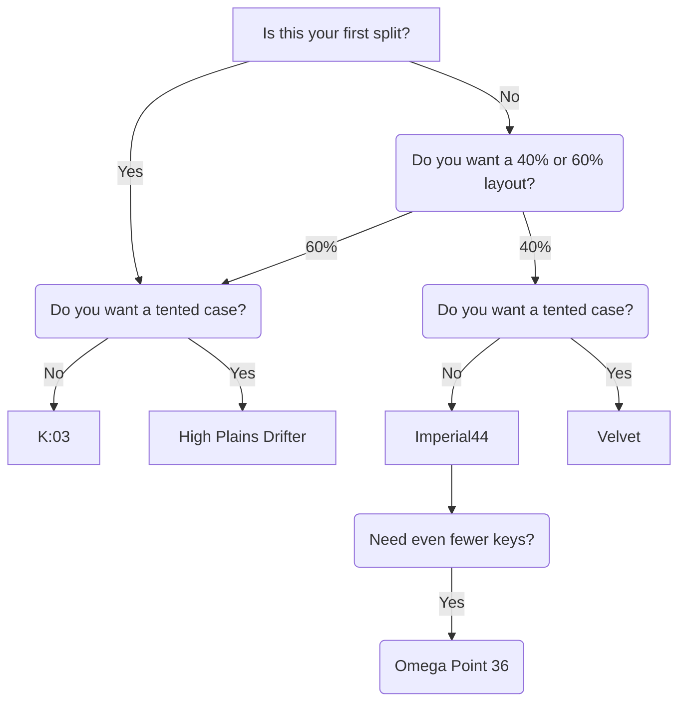

## Introduction

This article is written for those who are just discovering the world of ergonomic split keyboards. Here you will learn why a traditional keyboard is not a physiologically optimal tool, get familiar with the key concepts and features of splits, and receive practical recommendations for choosing your first device.

---

## Ergonomics

Place your hands on the table in a relaxed position. Chances are they are slightly turned outward — this is natural for the anatomy of the shoulder girdle. Now place them on a standard keyboard: your wrists rotate inward, your shoulders slightly round forward. This is the forced position in which most people spend hours at the computer every day.

A **split keyboard** solves this problem simply: two independent halves can be spread to shoulder width and rotated to a comfortable angle. Your hands rest the way they naturally want to, not the way the device's form factor demands.

Another feature of ergonomic splits is **columnar key layout**. On a standard keyboard, key rows are staggered horizontally — a legacy of typewriter mechanics. Fingers move vertically, so on a columnar keyboard each finger lands on its own column with minimal effort. Fewer unnecessary movements means less fatigue during long work sessions.

---

## Anatomy of Split Keyboards

### Switches

**Mechanical switches** are the foundation of any mechanical keyboard. Your choice determines the feel of keystrokes, the sound, and the actuation force required. All Ergohaven keyboards support **hotswap**: switches can be replaced without soldering at any time.


  
The keystroke is **smooth**, with no tactile bump and no extra force at the actuation point. Great for fast typing and gaming.

**Example:** Outemu GTMX Red (50 g, low-profile)
  
  
At the actuation point you feel a slight **bump** — tactile feedback. Helps you sense the moment of key registration. A popular choice for office work and writing.

**Examples:** Outemu GTMX Brown (55 g, low-profile), Outemu Silent Tom (50 g, silent)
  


### Keycaps

**Keycaps** are the caps placed on top of the switches. They affect the keyboard's appearance, the feel under your fingers, and the convenience of labeling.


A **profile** is the shape and height of a keycap. The Ergohaven lineup offers the following options:

- **XDA** — low, spherical, uniform across all rows. Convenient on splits where there is no conventional row division.
- **DSA** — similar to XDA, slightly more rounded. Also row-agnostic.
- **Low-profile** — specially selected keycaps for low-profile switches.
- **Space Encounters LP** — original low-profile keycaps with a unique design.



Keycaps are available in two variants:

- **Labeled** — keys are marked, convenient for beginners.
- **Blank** — clean keycaps without markings, for those who touch-type and prefer a minimalist look.



- **PBT** — hard and durable plastic that doesn't develop shine with extended use. The primary material for most keycaps.
- **SLA resin** — keycaps made by photopolymer 3D printing. Allows for detailed shapes and unique designs.



All Ergohaven keyboards use the standard **MX** mount, ensuring compatibility with most keycaps on the market.


### Form factor: key count

**Compactness** is one of the defining characteristics of ergonomic keyboards. Fewer keys means less hand movement and a more focused layout.

| Format | Keys | Description | Ergohaven example |
|--------|------|-------------|-------------------|
| **60%** | ~60 | Full alphabet, no number row. A good balance for beginners | *K:03* (60 keys) |
| **40%** | ~40–46 | Ultra-compact. Requires active use of layers | *Imperial44*, *Velvet* |
| **30% and below** | 36 and fewer | For experienced users, maximum minimization of hand movement | *Omega Point 36* |

### Form factor: case


  
**Traditional design**: both halves lie in the same horizontal plane. Simple to manufacture and maintain. A good starting point.

**Example:** *K:03*, *Imperial44*
  
  
The case is **raised on the inner side**, mimicking the neutral hand position. Reduces forearm pronation — when the wrist is turned palm-down. Especially beneficial during long work sessions.

**Example:** *High Plains Drifter v2*, *Velvet v3*
  


### Connection type


  
The halves are connected to each other via a **USB-C** cable, and one half connects to the computer. Minimal latency, no charging required.

**Firmware:** QMK. **Configuration:** [Vial](https://eh.works/vial).
  
  
The halves communicate **wirelessly**, with the computer connection via Bluetooth. Up to **5 device profiles**. Requires periodic charging (~2 hours, lasts several weeks on a charge).

**Firmware:** ZMK. **Configuration:** [Keymap Editor](https://docs.ergohaven.xyz/zmk/keymap-editor/) (web browser).
  


### Software

| Firmware | Configurator | Supported devices |
|----------|--------------|-------------------|
| **QMK** | [Vial](https://eh.works/vial) (desktop) | All wired Ergohaven models |
| **ZMK** | [Keymap Editor](https://docs.ergohaven.xyz/zmk/keymap-editor/) (web) | All wireless Ergohaven models |

Both configurators require no programming knowledge — just a mouse and a browser.

### Add-on modules

Several Ergohaven keyboards support plug-in **modules** that extend functionality:

- **Encoder** — a rotary knob for adjusting volume, zoom, scrolling, and other functions;
- **Trackball** — cursor control without taking your hands off the keyboard;
- **Touchpad** — a touch panel with gesture support;
- **Joystick** — an alternative method of cursor control.

---

## Pros and Cons

### Advantages

- **Joint health.** The natural hand position reduces stress on wrists, elbows, and shoulders. For people who spend 6–8+ hours a day at a computer, this is a significant factor.
- **Flexible customization.** Every key can be programmed for a specific task. Work layers, gaming profiles, macros — all configured without any programming.
- **Long-term value.** A quality split lasts for years. Hotswap lets you change switches as your preferences evolve.
- **Mindful typing.** Switching to a split often comes with adopting touch typing — and typing speed ultimately increases.

### Disadvantages


**Adaptation period.** For the first 2–4 weeks, your typing speed will drop. This is a normal process of retraining muscle memory. Returning to a standard keyboard during the learning period significantly slows down adjustment.


- **Learning curve.** You need to understand layers, firmware, and the configurator. This takes a few hours with good documentation.
- **Cost.** A quality split is more expensive than a mass-market office keyboard. However, it is an investment in health and productivity, not just an accessory.

---

## First Steps: How to Choose Your First Keyboard

### Step 1: Decide on wired vs. wireless

If you work at one computer and don't want to think about charging — go **wired**. If freedom from cables and the ability to switch between devices matters — go **wireless**.

### Step 2: Choose a form factor


For split keyboard beginners, starting with the **60% format** is recommended. It keeps the familiar number of letters and symbols but removes unnecessary rows. Moving to 40% is better done consciously, once you've figured out layers.



  
  
  


### Step 3: Choose your switches

If you've never used a mechanical keyboard — start with **tactile switches** of medium weight (45–55 gf). They provide clear feedback without tiring your fingers. **Linear switches** are a great fit for those who value silence and smoothness.

Thanks to hotswap, switches can be changed at any time — your initial choice is not final.

---

## Conclusion

A **split keyboard** is not just a different input device. It is a rethinking of a familiar tool from the perspective of anatomy and long-term comfort. Yes, the transition will take time. But most users who have mastered a split never go back to standard keyboards.

Ergohaven designs devices where ergonomics, quality, and customization options come together in one package. Every model comes with a **3-year warranty** and community support.


  
  

