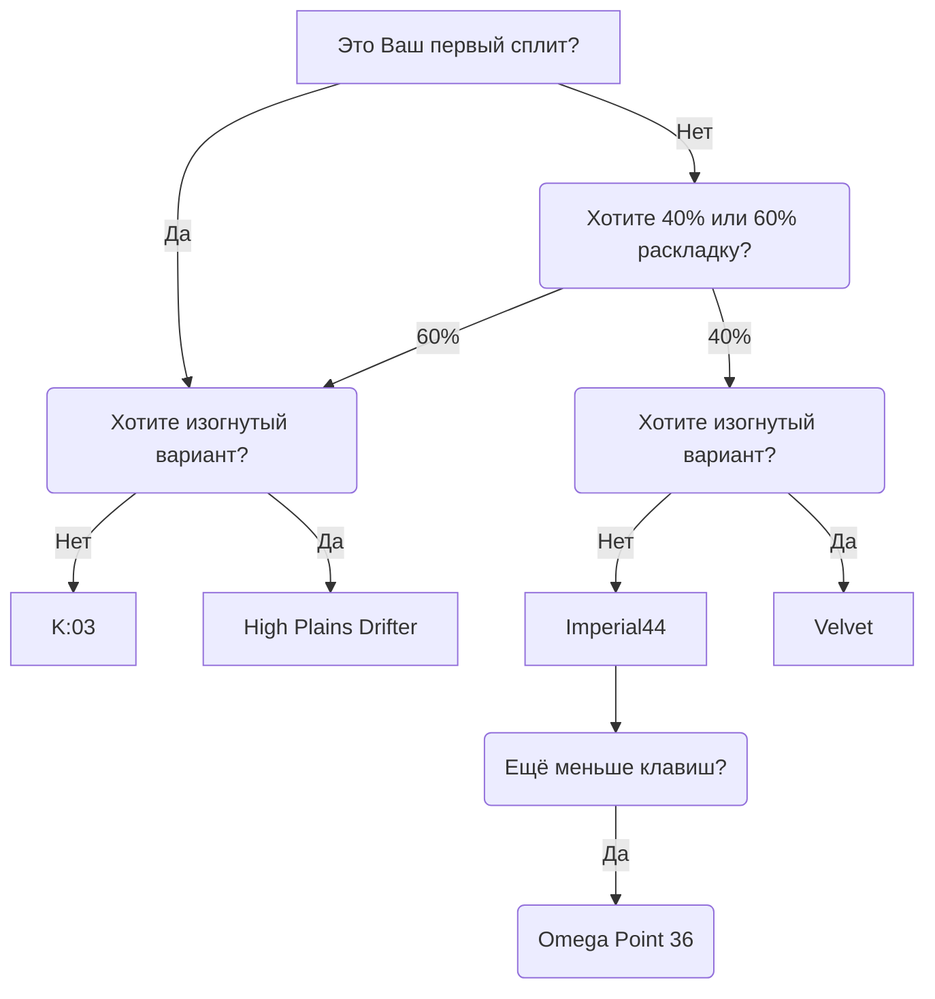

## Введение

Эта статья создана для тех, кто только открывает для себя мир эргономичных сплит-клавиатур. Здесь вы узнаете, почему традиционная клавиатура не является физиологически оптимальным инструментом, познакомитесь с ключевыми понятиями и характеристиками сплитов, а также получите практические рекомендации по выбору первого устройства.

---

## Эргономика

Положите руки на стол в расслабленном состоянии. Скорее всего, они немного развёрнуты наружу — это естественно для анатомии плечевого пояса. Теперь положите их на стандартную клавиатуру: запястья разворачиваются внутрь, плечи немного сводятся вперёд. Именно в таком вынужденном положении большинство людей проводят за компьютером часы каждый день.

**Сплит-клавиатура** решает эту проблему просто: две независимые половинки можно развести на ширину плеч и повернуть под удобный угол. Руки лежат так, как им комфортно, а не так, как требует форм-фактор устройства.

Ещё одна особенность эргономичных сплитов — **колончатое расположение клавиш**. На обычной клавиатуре ряды клавиш смещены по горизонтали — это наследие механики печатных машинок. Пальцы же двигаются вертикально, поэтому на колончатой клавиатуре каждый палец попадает на свой столбец с минимальным усилием. Меньше лишних движений — меньше усталости при длительной работе.

---

## Анатомия сплит-клавиатур

### Переключатели (свитчи)

**Механические переключатели** — основа любой механической клавиатуры. От их выбора зависит ощущение нажатия, звук и необходимое усилие. Все клавиатуры Ergohaven поддерживают **хотсвап**: свитчи меняются без пайки в любой момент.


  
Нажатие **плавное**, без тактильного щелчка и дополнительного усилия в точке срабатывания. Подходят для быстрого набора текста и игр.

**Пример:** Outemu GTMX Red (50 г, низкопрофильные)
  
  
В момент срабатывания ощущается лёгкий **«бамп»** — тактильный отклик. Помогают чувствовать момент регистрации нажатия. Популярный выбор для офиса и работы с текстом.

**Примеры:** Outemu GTMX Brown (55 г, низкопрофильные), Outemu Silent Tom (50 г, бесшумные)
  


### Кейкапы

**Кейкапы** — это колпачки, надеваемые на переключатели. Они влияют на внешний вид клавиатуры, ощущение под пальцами и удобство маркировки.


**Профиль** — это форма и высота кейкапа. В линейке Ergohaven доступны следующие варианты:

- **XDA** — низкие, сферические, одинаковые на всех рядах. Удобны на сплитах, где нет привычного деления на ряды.
- **DSA** — схожи с XDA, чуть более скруглённые. Также универсальны по рядам.
- **Низкопрофильные** — специально подобранные кейкапы для низкопрофильных свитчей.
- **Space Encounters LP** — авторские низкопрофильные кейкапы с оригинальным дизайном.



Кейкапы доступны в двух вариантах исполнения:

- **С символами** — клавиши подписаны, удобно для начинающих пользователей.
- **Без символов (blank)** — чистые кейкапы без маркировки, для тех, кто владеет слепым методом печати и предпочитает минималистичный вид.



- **PBT** — твёрдый и долговечный пластик, не блестит при длительном использовании. Основной материал для большинства кейкапов.
- **SLA-смола** — кейкапы, изготовленные методом фотополимерной 3D-печати. Позволяют создавать детализированные формы и уникальный дизайн.



Все клавиатуры Ergohaven используют стандартное крепление **MX**, что обеспечивает совместимость с большинством кейкапов на рынке.


### Форм-фактор: количество клавиш

**Компактность** — одна из главных характеристик эргономичных клавиатур. Меньше клавиш означает меньше движений рук и более концентрированное расположение всех функций.

| Формат | Клавиш | Описание | Пример в линейке Ergohaven |
|--------|--------|----------|----------------------------|
| **60%** | ~60 | Полный алфавит, без цифрового ряда. Хороший баланс для новичков | *K:03* (60 кл.) |
| **40%** | ~40–46 | Ультракомпактный. Требует активного использования слоёв | *Imperial44*, *Velvet* |
| **30% и менее** | 36 и меньше | Для опытных пользователей, максимальная минимизация движений | *Omega Point 36* |

### Форм-фактор: корпус


  
**Традиционная конструкция**: половинки лежат в одной горизонтальной плоскости. Просты в изготовлении и обслуживании. Подходят как начальная точка.

**Пример:** *K:03*, *Imperial44*
  
  
Корпус **приподнят с внутренней стороны**, имитируя нейтральное положение ладони. Снижает пронацию предплечья — когда запястье повёрнуто ладонью вниз. Особенно полезно при длительной работе.

**Пример:** *High Plains Drifter v2*, *Velvet v3*
  


### Тип подключения


  
Половинки соединяются между собой кабелем **USB-C**, одна из них подключается к компьютеру. Минимальная задержка, не требует зарядки.

**Прошивка:** QMK. **Настройка:** [Vial](https://eh.works/vial).
  
  
Половинки общаются по **беспроводному протоколу**, подключение к компьютеру — по Bluetooth. До **5 профилей** устройств. Требует периодической зарядки (~2 часа, работа от нескольких недель).

**Прошивка:** ZMK. **Настройка:** [Keymap Editor](https://docs.ergohaven.xyz/zmk/keymap-editor/) (веб-браузер).
  


### Программное обеспечение

| Прошивка | Конфигуратор | Для каких устройств |
|----------|--------------|----------------------|
| **QMK** | [Vial](https://eh.works/vial) (десктоп) | Все проводные модели Ergohaven |
| **ZMK** | [Keymap Editor](https://docs.ergohaven.xyz/zmk/keymap-editor/) (веб) | Все беспроводные модели Ergohaven |

Оба конфигуратора не требуют знания программирования — достаточно мыши и браузера.

### Дополнительные модули

Ряд клавиатур Ergohaven поддерживает подключаемые **модули**, расширяющие функциональность:

- **Энкодер** — поворотная ручка для регулировки громкости, масштаба, прокрутки и других функций;
- **Трекбол** — управление курсором без отрыва рук от клавиатуры;
- **Тачпад** — сенсорная панель с поддержкой жестов;
- **Джойстик** — альтернативный способ управления курсором.

---

## Плюсы и минусы

### Преимущества

- **Здоровье суставов.** Естественное положение рук снижает нагрузку на запястья, локти и плечи. Для людей, проводящих за компьютером 6–8 и более часов в день, это существенный фактор.
- **Гибкая кастомизация.** Каждая клавиша программируется под конкретную задачу. Рабочие слои, игровые профили, макросы — всё настраивается без программирования.
- **Долгосрочная ценность.** Качественный сплит служит годами. Хотсвап позволяет менять свитчи по мере развития предпочтений.
- **Осознанная печать.** Переход на сплит часто сопровождается переходом на слепой метод — и скорость печати в итоге вырастает.

### Недостатки


**Период адаптации.** Первые 2–4 недели скорость набора снизится. Это нормальный процесс перестройки мышечной памяти. Возвращение к стандартной клавиатуре в процессе обучения существенно замедляет привыкание.


- **Порог вхождения.** Нужно разобраться с понятиями слоёв, прошивки и конфигуратора. Это занимает несколько часов при наличии хорошей документации.
- **Стоимость.** Качественный сплит дороже массового офисного устройства. Однако это вложение в здоровье и производительность, а не просто аксессуар.

---

## Первые шаги: как выбрать первую клавиатуру

### Шаг 1: определите приоритет — проводная или беспроводная

Если вы работаете за одним компьютером и не хотите думать о зарядке — выбирайте **проводную** модель. Если важна свобода от проводов и возможность переключаться между устройствами — **беспроводную**.

### Шаг 2: выберите форм-фактор


Для новичков в сплит-клавиатурах рекомендуется начать с **60% формата**. Он сохраняет привычное количество букв и символов, но убирает лишние ряды. Переход на 40% лучше делать осознанно, уже разобравшись со слоями.



  
  
  


### Шаг 3: выберите свитчи

Если вы никогда не работали с механической клавиатурой — начните с **тактильных свитчей** средней жёсткости (45–55 гф). Они дают понятную обратную связь и не утомляют пальцы. **Линейные свитчи** хорошо подходят тем, кто ценит тишину и плавность.

Благодаря хотсвапу свитчи можно поменять в любой момент — первоначальный выбор не является окончательным.

---

## Заключение

**Сплит-клавиатура** — это не просто другое устройство ввода. Это переосмысление привычного инструмента с позиции анатомии и долгосрочного комфорта. Да, переход потребует времени. Но большинство пользователей, освоивших сплит, уже не возвращаются к стандартным клавиатурам.

Ergohaven разрабатывает устройства, в которых эргономика, качество и возможности кастомизации объединены в единое целое. Каждая модель сопровождается **трёхлетней гарантией** и поддержкой сообщества.


  
  

